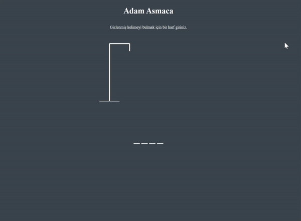

<h1> Adam Asmaca Oyunu</h1>

Bu proje tarayıcı üzerinde oynanabilen basit bir Adam Asmaca (Hangman) oyununu içermektedir.
Oyun başladığında bir kelime seçilecek ve size sadece harf girişi yapmanız istenecektir. Doğru harfleri tahmin ederek kelimeyi bulmaya çalışın. Yanlış tahminlerde, hatalı harfler listesi ve adam asma figürü oluşturulur. Kazanma veya kaybetme durumlarında ekranda ilgili mesajlar görüntülenir.

<h2> Özellikler </h2>

<ul>
<li>Rastgele seçilen kelimelerle oyunun zorluk seviyesinin ayarlanabilir.</li>
<li>Harf girişi yapılarak kelimenin tahmin edilir.</li>
<li>Doğru tahminlerde harflerin yerleri gösterilir ve yanlış tahminlerde hatalı harfler listelenir.</li>
<li>Oyunun sonunda kazanma veya kaybetme durumlarına göre bildirimler görüntülenir.</li>
<li>Tekrarlanan harflerde uyarı mesajı gösterilir.</li>
</ul>

<h2> Kullanilan Teknolojiler </h2>
<ul>
<li>HTML</li>
<li>CSS</li>
<li>JavaScript</li>
</ul>

<h2>Ekran Görüntüsü</h2>

